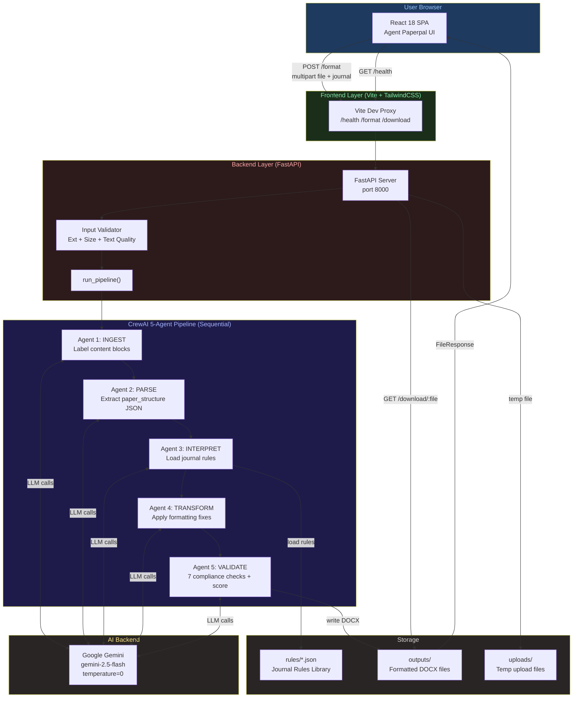
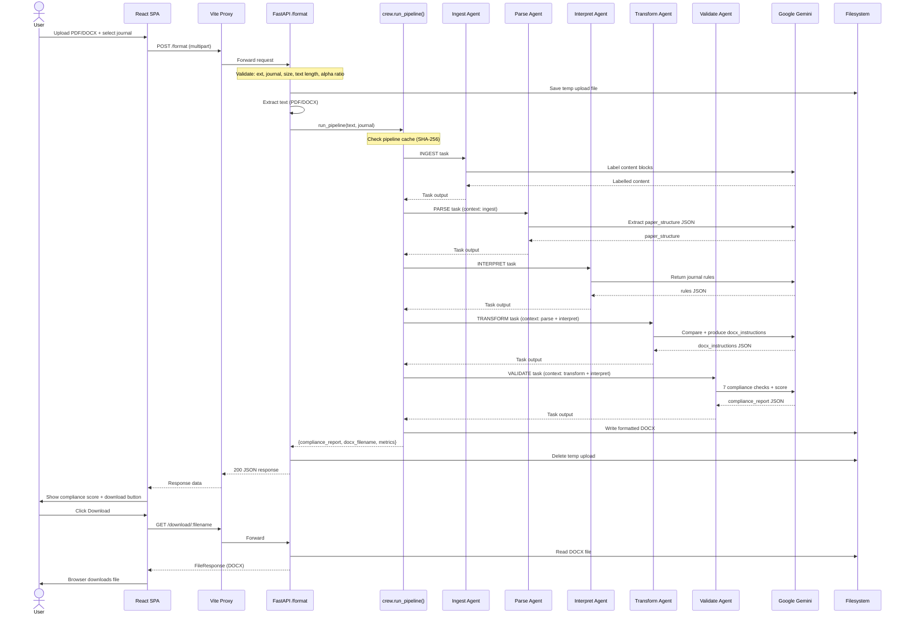
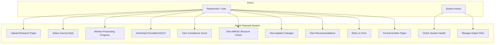
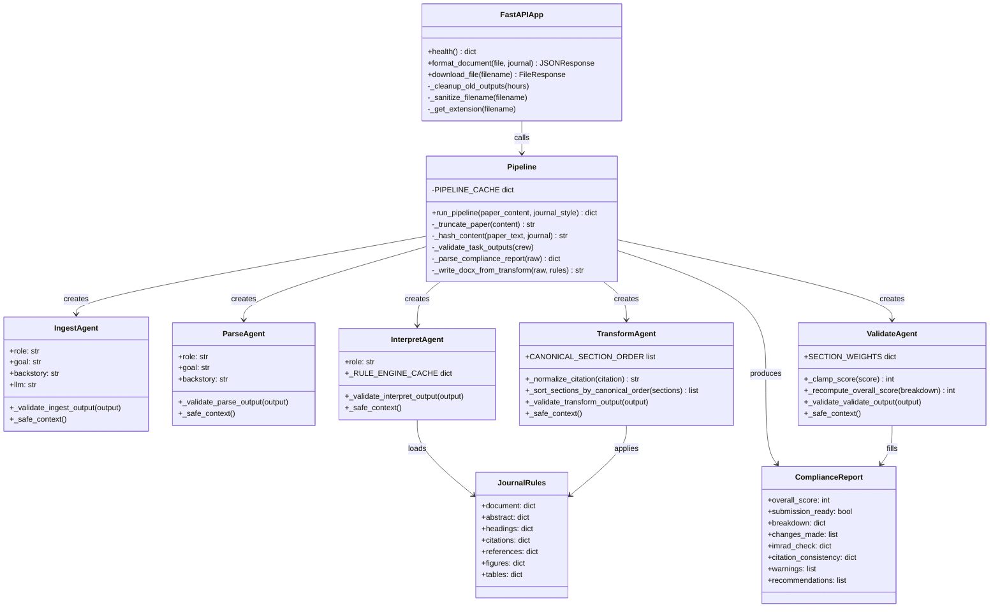
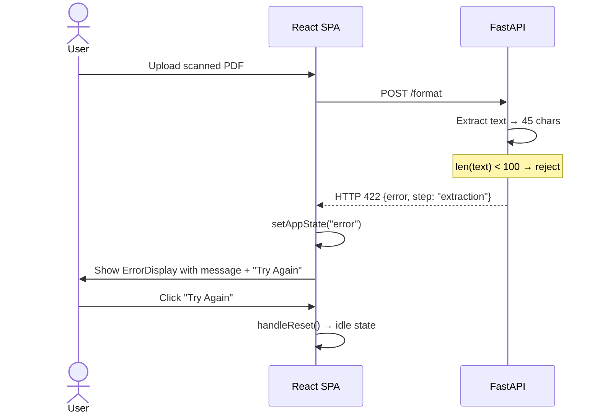
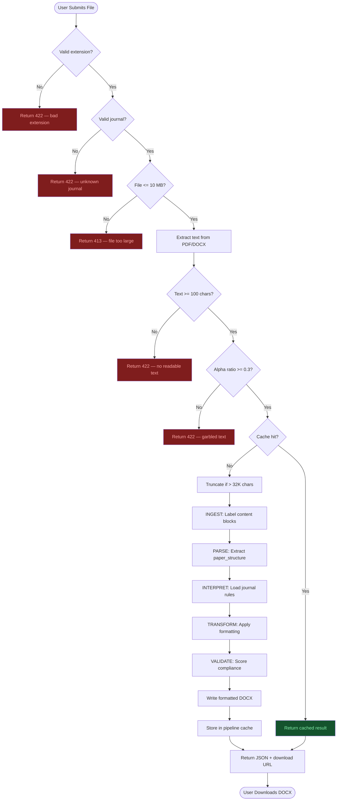
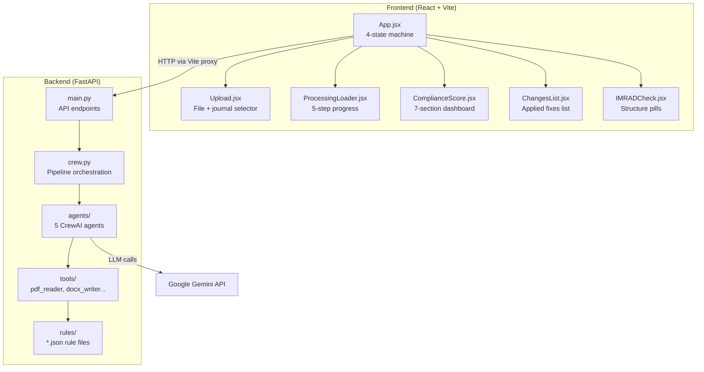

# Agent Paperpal

> Autonomous manuscript formatting system built for HackaMined 2026 — Cactus Communications (Paperpal by Editage) track.

Agent Paperpal is a full-stack AI application that accepts a research paper (PDF or DOCX) and a target journal style, then autonomously detects every formatting violation, applies corrections, generates a formatted DOCX output, and produces a scored compliance report — all powered by a 5-agent CrewAI pipeline backed by Google Gemini.

---

## Table of Contents

- [Project Overview](#project-overview)
- [High-Level Architecture](#high-level-architecture)
- [System Architecture](#system-architecture)
- [Technology Stack](#technology-stack)
- [Directory Structure](#directory-structure)
- [Application Workflow](#application-workflow)
- [UML Diagrams](#uml-diagrams)
- [API Documentation](#api-documentation)
- [Quick Start](#quick-start)
- [Environment Variables](#environment-variables)
- [Running the Project](#running-the-project)
- [Security Considerations](#security-considerations)
- [Performance Optimizations](#performance-optimizations)
- [Future Roadmap](#future-roadmap)
- [Contributing](#contributing)
- [License](#license)

---

## Project Overview

### Problem Statement

Researchers spend significant time manually reformatting manuscripts for journal submission — adjusting citation styles, heading hierarchies, abstract word counts, figure numbering, and reference formatting. A single journal style can have 50+ distinct rules. Missing even a few causes desk rejection.

### Solution

Agent Paperpal eliminates manual formatting effort through a multi-agent AI pipeline:

1. **Ingests** raw PDF/DOCX content and labels every structural element
2. **Parses** the paper into a structured JSON schema
3. **Interprets** the target journal's formatting rules from a curated rules library
4. **Transforms** the paper by applying all required fixes
5. **Validates** compliance across 7 dimensions and scores from 0-100

### Key Features

| Feature | Description |
|---------|-------------|
| Multi-format input | Upload PDF or DOCX (up to 10 MB) |
| 5 journal styles | APA 7th Edition, IEEE, Vancouver, Springer, Chicago 17th |
| 5-agent AI pipeline | Sequential CrewAI agents, each with a single responsibility |
| Compliance scoring | 7-section breakdown (Document Format, Abstract, Headings, Citations, References, Figures, Tables) |
| IMRAD detection | Checks for Introduction, Methods, Results, Discussion presence |
| DOCX output | Formatted manuscript ready for download |
| Pipeline caching | SHA-256 keyed in-memory cache — identical submissions return instantly |
| No timeout | Pipeline runs until complete, regardless of paper size |

### Target Users

- Academic researchers submitting papers to journals
- Graduate students formatting theses/dissertations
- Research editors and peer-review coordinators

---

## High-Level Architecture



---

## System Architecture

Agent Paperpal uses a **layered architecture** with a clear separation between:

- **Presentation layer** — React SPA with a 4-state machine (`idle → loading → success → error`)
- **API layer** — FastAPI with input validation, error mapping, and file lifecycle management
- **Orchestration layer** — CrewAI `Crew` with `Process.sequential` ensuring strict agent ordering
- **Agent layer** — 5 single-responsibility agents, each producing validated JSON output
- **Tool layer** — PDF reader, DOCX reader, DOCX writer, rule loader, structured logger
- **Storage layer** — Local filesystem (`rules/`, `uploads/`, `outputs/`)

### Component Responsibilities

| Component | Responsibility |
|-----------|---------------|
| `main.py` | HTTP routing, input validation (5 guards), error mapping, file cleanup |
| `crew.py` | Pipeline orchestration, caching, truncation, task output validation |
| `agents/ingest_agent.py` | Label raw text blocks with structural type markers |
| `agents/parse_agent.py` | Extract structured `paper_structure` JSON from labelled content |
| `agents/interpret_agent.py` | Load and return journal rules JSON |
| `agents/transform_agent.py` | Compare paper vs rules, produce `docx_instructions` |
| `agents/validate_agent.py` | Run 7 compliance checks, score 0-100, return `compliance_report` |
| `tools/docx_writer.py` | Write formatted DOCX from `docx_instructions` |
| `tools/rule_loader.py` | Load and cache `rules/*.json` files |
| `tools/pdf_reader.py` | Extract text from PDF via PyMuPDF |
| `tools/docx_reader.py` | Extract text from DOCX via python-docx |

---

## Technology Stack

| Layer | Technology | Version | Purpose |
|-------|-----------|---------|---------|
| Frontend | React | 18.3.1 | UI component library |
| Frontend | Vite | 7.3.1 | Dev server + build tool + proxy |
| Frontend | TailwindCSS | 3.4.3 | Utility-first dark-theme styling |
| Frontend | Axios | 1.7.2 | HTTP client with proxy support |
| Frontend | Lucide React | 0.378.0 | Icon library |
| Backend | Python | 3.11+ | Primary backend language |
| Backend | FastAPI | 0.111.0 | Async HTTP API framework |
| Backend | Uvicorn | 0.29.0 | ASGI server |
| AI Orchestration | CrewAI | >=0.36.0 | Multi-agent pipeline framework |
| AI Model | Google Gemini | 2.5-flash | LLM for all 5 agents |
| Document Processing | PyMuPDF (fitz) | 1.24.0 | PDF text extraction |
| Document Processing | python-docx | 1.1.0 | DOCX read and write |
| Validation | jsonschema | >=4.0.0 | JSON schema validation |
| Config | python-dotenv | >=1.0.0 | Environment variable management |

---

## Directory Structure

```
HACKa-MINed/
│
├── backend/                        # FastAPI + CrewAI backend
│   ├── agents/                     # 5 CrewAI agent definitions
│   │   ├── __init__.py             # Exports all 5 create_*_agent() factories
│   │   ├── ingest_agent.py         # Agent 1: Content labelling
│   │   ├── parse_agent.py          # Agent 2: Structure extraction
│   │   ├── interpret_agent.py      # Agent 3: Rule loading
│   │   ├── transform_agent.py      # Agent 4: Formatting application
│   │   └── validate_agent.py       # Agent 5: Compliance scoring
│   │
│   ├── engine/                     # Formatting engine utilities
│   │   └── format_engine.py        # Document formatting helpers
│   │
│   ├── tools/                      # Shared utility tools
│   │   ├── pdf_reader.py           # PDF text extraction (PyMuPDF)
│   │   ├── docx_reader.py          # DOCX text extraction (python-docx)
│   │   ├── docx_writer.py          # Formatted DOCX generation
│   │   ├── rule_loader.py          # Journal rules JSON loader + JOURNAL_MAP
│   │   ├── logger.py               # Structured logger factory (get_logger)
│   │   └── tool_errors.py          # Custom exception hierarchy
│   │
│   ├── rules/                      # Journal formatting rules (JSON)
│   │   ├── apa7.json               # APA 7th Edition rules
│   │   ├── ieee.json               # IEEE rules
│   │   ├── vancouver.json          # Vancouver rules
│   │   ├── springer.json           # Springer rules
│   │   └── chicago.json            # Chicago 17th Edition rules
│   │
│   ├── outputs/                    # Generated DOCX files (auto-cleaned after 6h)
│   ├── uploads/                    # Temp upload files (deleted after processing)
│   ├── crew.py                     # Pipeline orchestration + caching
│   ├── main.py                     # FastAPI app, endpoints, validation
│   ├── requirements.txt            # Python dependencies
│   ├── .env                        # Runtime secrets (not committed)
│   └── .env.example                # Template for environment setup
│
├── frontend/                       # React 18 + Vite frontend
│   ├── src/
│   │   ├── components/             # UI components
│   │   │   ├── Upload.jsx          # File + journal selector form
│   │   │   ├── ProcessingLoader.jsx # 5-step pipeline progress UI
│   │   │   ├── ComplianceScore.jsx  # Score dashboard with animated bars
│   │   │   ├── ChangesList.jsx      # Applied changes with expand/collapse
│   │   │   └── IMRADCheck.jsx       # IMRAD structure status pills
│   │   ├── App.jsx                  # Root: 4-state machine + layout
│   │   ├── index.css               # Tailwind base + keyframes + utilities
│   │   └── main.jsx                # React DOM entry point
│   │
│   ├── public/                     # Static assets
│   ├── package.json                # Node dependencies
│   ├── vite.config.js              # Vite + proxy configuration
│   ├── tailwind.config.js          # Tailwind theme config
│   └── postcss.config.js           # PostCSS config
│
├── .github/
│   └── agents/                     # Claude Code agent instruction files
│       ├── UNIVERSAL_AGENT.md
│       ├── PROJECT_ARCHITECTURE.md
│       ├── AI_AGENT.md
│       └── Full-Stack Agents/
│           ├── api-agent.md
│           ├── ui-ux-agent.md
│           ├── test-agent.md
│           └── docs-agent.md
│
├── Prompts/                        # Step-by-step build prompts (hackathon docs)
├── tasks/                          # Claude Code task tracking
├── .claude/CLAUDE.md               # Claude Code behavioral config
└── README.md                       # This file
```

---

## Application Workflow

### End-to-End Flow



---

## UML Diagrams

### Use Case Diagram



### Class Diagram



### Sequence Diagram — Error Path



### Activity Diagram — Pipeline



### Component Diagram



---

## API Documentation

### GET /health

Health check — returns system status and supported journals.

| Field | Value |
|-------|-------|
| Method | `GET` |
| URL | `/health` |
| Auth | None |

**Response 200:**
```json
{
  "status": "ok",
  "version": "1.0.0",
  "service": "Agent Paperpal",
  "supported_journals": ["APA 7th Edition", "IEEE", "Vancouver", "Springer", "Chicago 17th Edition"],
  "max_file_size_mb": 10,
  "system_info": {
    "python_version": "3.11.0",
    "crewai_version": "0.36.0",
    "api_uptime_seconds": 142.3
  },
  "diagnostics": {
    "rules_folder_exists": true,
    "outputs_folder_writable": true
  }
}
```

---

### POST /format

Upload a research paper and format it.

| Field | Value |
|-------|-------|
| Method | `POST` |
| URL | `/format` |
| Content-Type | `multipart/form-data` |
| Auth | None |

**Request Body (multipart):**

| Field | Type | Required | Description |
|-------|------|----------|-------------|
| `file` | File | Yes | PDF or DOCX, max 10 MB |
| `journal` | String | Yes | One of the supported journal names |

**Response 200:**
```json
{
  "success": true,
  "request_id": "3193503d",
  "download_url": "/download/formatted_3193503d.docx",
  "compliance_report": {
    "overall_score": 84,
    "submission_ready": true,
    "breakdown": {
      "document_format": { "score": 90, "issues": [] },
      "abstract":        { "score": 75, "issues": ["Word count 312 exceeds 250 limit"] },
      "headings":        { "score": 95, "issues": [] },
      "citations":       { "score": 80, "issues": ["2 in-text citations use wrong format"] },
      "references":      { "score": 85, "issues": [] },
      "figures":         { "score": 100, "issues": [] },
      "tables":          { "score": 70, "issues": ["Table 2 missing title"] }
    },
    "changes_made": ["Reformatted 14 in-text citations to APA style", "..."],
    "imrad_check": {
      "introduction": true,
      "methods": true,
      "results": true,
      "discussion": false
    },
    "citation_consistency": {
      "orphan_citations": [],
      "uncited_references": ["Smith et al. 2019"]
    },
    "warnings": ["3 references older than 10 years"],
    "recommendations": ["Add a Discussion section to complete IMRAD structure"]
  },
  "changes_made": ["Reformatted 14 in-text citations to APA style"],
  "processing_time_seconds": 47.3,
  "output_metadata": { "filename": "formatted_3193503d.docx", "size_bytes": 24576, "size_kb": 24.0 },
  "pipeline_metrics": {
    "stage_times": { "ingest": 9.2, "parse": 11.4, "interpret": 1.8, "transform": 14.6, "validate": 10.1 },
    "total_runtime": 47.3
  }
}
```

**Error Responses:**

| Status | Code | When |
|--------|------|------|
| 413 | — | File > 10 MB |
| 422 | `validation` | Bad extension, unknown journal, no readable text |
| 422 | `extraction` | Extracted text too short or garbled |
| 422 | `llm` | Gemini returned unparseable response |
| 422 | `transform` | Transform agent failed to produce docx_instructions |
| 500 | — | Unexpected server error |

---

### GET /download/{filename}

Download a formatted DOCX file.

| Field | Value |
|-------|-------|
| Method | `GET` |
| URL | `/download/{filename}` |
| Auth | None |

**Path Parameters:**

| Parameter | Description |
|-----------|-------------|
| `filename` | Exact filename returned in `download_url` from `/format` |

**Response 200:** Binary DOCX file stream

**Security:** Regex validates filename (`^[a-zA-Z0-9_\-\.]+$`), only `.docx` served, path confined to `outputs/` directory.

---

## Quick Start

### Prerequisites

- Python 3.11+
- Node.js 18+ (for frontend)
- Google Gemini API key (free tier available at [Google AI Studio](https://aistudio.google.com))

### 1. Clone the Repository

```bash
git clone <repo-url>
cd HACKa-MINed
```

### 2. Set Up the Backend

```bash
cd backend
python3 -m venv venv
source venv/bin/activate        # Windows: venv\Scripts\activate
pip install -r requirements.txt
cp .env.example .env
# Edit .env and set GEMINI_API_KEY=your-key-here
```

### 3. Set Up the Frontend

```bash
cd ../frontend
npm install
```

### 4. Start Both Services

**Terminal 1 — Backend:**
```bash
cd backend
source venv/bin/activate
uvicorn main:app --reload --port 8000
```

**Terminal 2 — Frontend:**
```bash
cd frontend
npm run dev
```

Visit **http://localhost:5173** in your browser.

---

## Environment Variables

| Variable | Required | Description | Example |
|----------|----------|-------------|---------|
| `GEMINI_API_KEY` | Yes | Google Gemini API key | `AIzaSy...` |
| `GOOGLE_API_KEY` | Yes | Same as above (LiteLLM alias) | `AIzaSy...` |
| `GEMINI_MODEL` | No | Gemini model name | `gemini-2.5-flash` |
| `CORS_ORIGINS` | No | Comma-separated allowed origins | `http://localhost:5173` |
| `BACKEND_HOST` | No | Uvicorn bind host | `0.0.0.0` |
| `BACKEND_PORT` | No | Uvicorn bind port | `8000` |
| `LLM_TIMEOUT` | No | LLM call timeout seconds | `60` |
| `LLM_MAX_RETRIES` | No | LLM retry count | `3` |

---

## Running the Project

### Development

```bash
# Backend (hot-reload)
cd backend && uvicorn main:app --reload --port 8000

# Frontend (HMR dev server)
cd frontend && npm run dev
```

### Production Build (Frontend)

```bash
cd frontend
npm run build       # outputs to frontend/dist/
npm run preview     # preview the production build locally
```

### Production Backend

```bash
cd backend
uvicorn main:app --host 0.0.0.0 --port 8000 --workers 2
```

---

## Security Considerations

| Concern | Mitigation |
|---------|-----------|
| Path traversal in downloads | Filename regex `^[a-zA-Z0-9_\-\.]+$` + path prefix check |
| File type spoofing | Extension whitelist (`pdf`, `docx`) + content length check |
| Oversized uploads | Hard 10 MB limit enforced before text extraction |
| Garbled/scanned PDFs | Alpha-character ratio guard (>=0.3) rejects image-only PDFs |
| Unsafe filenames | `re.sub(r"[^a-zA-Z0-9._\-]", "_", filename)` before disk write |
| Stack trace leaks | Global FastAPI exception handler returns generic messages |
| API key exposure | All secrets in `.env`, never committed |
| CORS | Configurable `CORS_ORIGINS` env var, defaults to localhost only |
| Temp file cleanup | Upload files deleted in `finally` block regardless of success/failure |
| Stale output cleanup | Files older than 6 hours auto-deleted on startup |

---

## Performance Optimizations

| Optimization | Implementation |
|-------------|---------------|
| Pipeline caching | SHA-256 keyed in-memory dict — identical (paper + journal) submissions return instantly |
| Context truncation | Papers >32K chars are trimmed to first 24K + last 8K chars (preserves references) |
| Step timing | `_StepTimer` logs wall-clock per stage for performance analysis |
| No request timeout | `FORMAT_TIMEOUT_MS = 0` and Vite proxy `timeout: 0` — never kills in-flight requests |
| Stale file cleanup | Auto-cleanup on startup, not per-request |
| Rule caching | `InterpretAgent._RULE_ENGINE_CACHE` caches loaded rule files in memory |
| Animated skeleton UI | Compliance score shows skeleton rows during loading, not empty state |

---

## Future Roadmap

- [ ] Support additional journal styles (Nature, Elsevier, ACS, PLOS)
- [ ] Asynchronous processing with job queue (Celery + Redis) for concurrent users
- [ ] WebSocket progress updates from backend pipeline to frontend
- [ ] PDF output generation (in addition to DOCX)
- [ ] Persistent results storage (PostgreSQL) with 7-day retention
- [ ] User accounts and submission history
- [ ] Batch processing — format multiple papers in one session
- [ ] Side-by-side diff view — original vs formatted document
- [ ] Citation style migration (e.g., APA → IEEE conversion)
- [ ] Docker Compose deployment for one-command setup

---

## Contributing

### Branch Strategy

```
main          ← stable, production-ready
  └── develop ← integration branch
        └── feat/*, fix/*, docs/* ← feature branches
```

### Steps

1. Fork the repository
2. Create a branch from `develop`: `git checkout -b feat/your-feature`
3. Make changes following the code style in existing files
4. Commit using conventional commits: `feat(scope): description`
5. Push and open a PR targeting `develop`

### Commit Message Format

```
<type>(<scope>): <short description>

Types: feat | fix | docs | style | refactor | test | chore | security | ux
```

### Code Quality

- Backend: `mypy` for type checking, `python -m pytest` for tests
- Frontend: No TypeScript `any`, Lucide icons only (no emojis in JSX), Tailwind dark tokens only

---

## License

MIT License — see `LICENSE` file for details.

---

## Authors

Built for **HackaMined 2026** — Cactus Communications / Paperpal by Editage Track.

| Role | Contribution |
|------|-------------|
| Full-Stack Development | React SPA, FastAPI backend, CrewAI pipeline |
| AI/ML Engineering | 5-agent architecture, Gemini integration, prompt engineering |
| System Design | Layered architecture, caching strategy, error hierarchy |

---

*Agent Paperpal — Format once, submit with confidence.*
