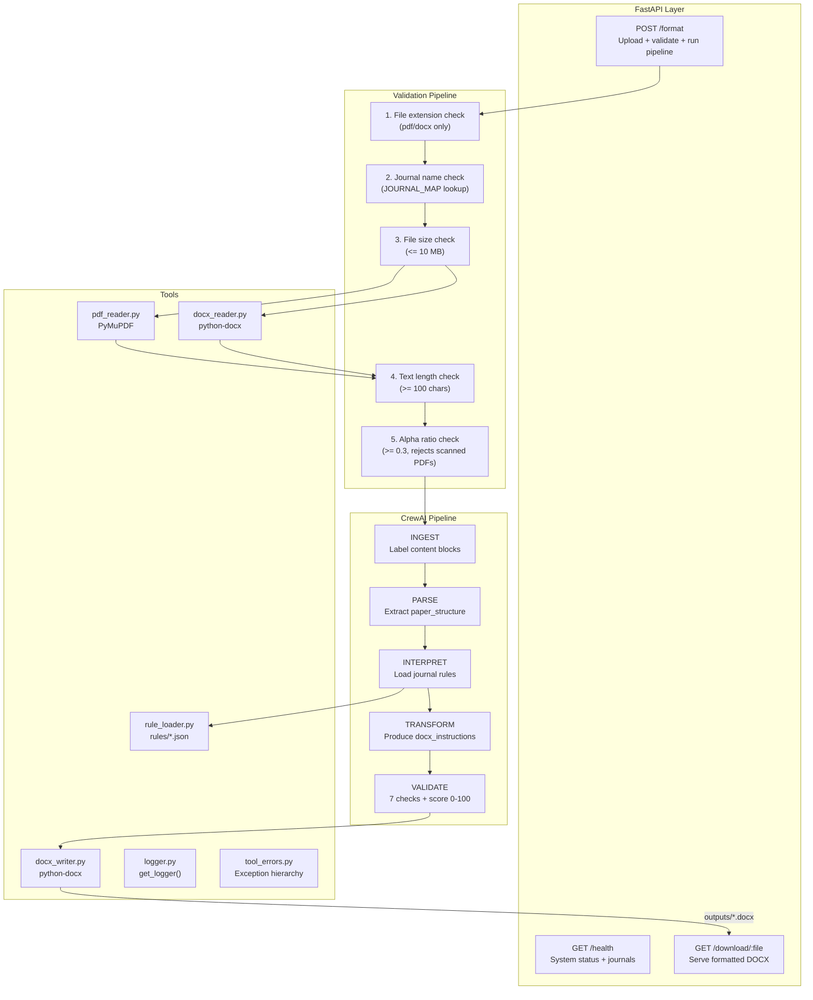

# Agent Paperpal — Backend

> FastAPI + CrewAI + Google Gemini — 5-agent autonomous manuscript formatting pipeline.

The backend is responsible for accepting research paper uploads, running the 5-agent CrewAI pipeline that detects and fixes formatting violations, writing the formatted DOCX output, and returning a scored compliance report.

---

## Table of Contents

- [Architecture Overview](#architecture-overview)
- [Agent Pipeline](#agent-pipeline)
- [Directory Structure](#directory-structure)
- [Technology Stack](#technology-stack)
- [API Reference](#api-reference)
- [Installation](#installation)
- [Environment Variables](#environment-variables)
- [Running the Server](#running-the-server)
- [Input Validation](#input-validation)
- [Error Handling](#error-handling)
- [Compliance Report Schema](#compliance-report-schema)
- [Journal Rules Schema](#journal-rules-schema)
- [Performance & Caching](#performance--caching)
- [Security](#security)
- [Testing](#testing)
- [Deployment](#deployment)

---

## Architecture Overview



---

## Agent Pipeline

The pipeline is a **sequential CrewAI `Crew`** — each agent receives context from prior agents via `Task.context`. All agents use `temperature=0` for deterministic output. All JSON is extracted using `extract_json_from_llm()` which handles markdown fences, Python literals, trailing commas, and single quotes.

### Agent 1 — INGEST

**Goal**: Label every structural block in the raw text with a type marker.

**Output format**: Plain text with prefixed markers:
```
[TITLE] Deep Learning for Medical Imaging
[ABSTRACT] This paper presents...
[HEADING_H1] Introduction
[BODY_PARAGRAPH] Neural networks have been...
[IN_TEXT_CITATION] (Smith et al., 2021)
[REFERENCE_ENTRY] Smith, J. et al. (2021). ...
```

**Supported labels**: `TITLE`, `ABSTRACT`, `KEYWORD`, `HEADING_H1`, `HEADING_H2`, `HEADING_H3`, `BODY_PARAGRAPH`, `IN_TEXT_CITATION`, `FIGURE_CAPTION`, `TABLE_CAPTION`, `REFERENCE_ENTRY`

---

### Agent 2 — PARSE

**Goal**: Convert labelled content into a structured `paper_structure` JSON.

**Output schema**:
```json
{
  "title": "string",
  "authors": ["string"],
  "abstract": { "text": "string", "word_count": 0 },
  "keywords": ["string"],
  "imrad": {
    "introduction": true,
    "methods": false,
    "results": true,
    "discussion": false
  },
  "sections": [
    {
      "heading": "string",
      "level": 1,
      "content_preview": "string",
      "in_text_citations": ["string"]
    }
  ],
  "figures": [{ "id": "Figure 1", "caption": "string" }],
  "tables": [{ "id": "Table 1", "caption": "string" }],
  "references": ["Full reference string"]
}
```

---

### Agent 3 — INTERPRET

**Goal**: Load and return the target journal's formatting rules JSON verbatim. Uses `_RULE_ENGINE_CACHE` for in-memory rule caching across requests.

**Input**: Journal name (e.g., `"APA 7th Edition"`)
**Output**: Full `rules/*.json` content as JSON

---

### Agent 4 — TRANSFORM

**Goal**: Compare paper structure against journal rules, identify violations, apply fixes, produce `docx_instructions`.

**Output schema**:
```json
{
  "violations": ["Citation format incorrect — expected (Author, Year)"],
  "changes_made": ["Reformatted 14 citations to APA format"],
  "docx_instructions": {
    "rules": {},
    "sections": [
      { "type": "title", "content": "Paper Title" },
      { "type": "abstract", "content": "Abstract text..." },
      { "type": "heading", "level": 1, "content": "Introduction" },
      { "type": "body", "content": "Body paragraph text..." },
      { "type": "reference", "content": "Smith, J. (2021). ..." }
    ]
  },
  "output_filename": "formatted_abc123.docx"
}
```

**Section types**: `title`, `abstract`, `keyword`, `heading` (with `level: 1|2|3`), `body`, `figure_caption`, `table_caption`, `reference`

Applies `_sort_sections_by_canonical_order()` (IMRAD ordering: Introduction → Methods → Results → Discussion) and `_normalize_citation()` for citation style normalization.

---

### Agent 5 — VALIDATE

**Goal**: Run 7 mandatory compliance checks and produce a `compliance_report` with per-section scores 0-100.

**7 Checks**:
1. Citation-to-reference 1:1 consistency (orphan citations, uncited references)
2. IMRAD structure completeness
3. Reference age (>50% older than 10 years → warning)
4. Self-citation rate (>30% same author → warning)
5. Figure sequential numbering (no gaps)
6. Table sequential numbering (no gaps)
7. Abstract word count vs journal limit

**Scoring**: Weighted formula across 7 sections. `_clamp_score()` enforces [0, 100] bounds. `_recompute_overall_score()` cross-checks the weighted formula for consistency. Score >= 80 sets `submission_ready: true`.

---

## Directory Structure

```
backend/
│
├── agents/                      # CrewAI agent factory functions
│   ├── __init__.py              # Exports create_*_agent() for all 5 agents
│   ├── ingest_agent.py          # create_ingest_agent(llm) → Agent
│   ├── parse_agent.py           # create_parse_agent(llm) → Agent
│   ├── interpret_agent.py       # create_interpret_agent(llm) → Agent
│   ├── transform_agent.py       # create_transform_agent(llm) → Agent
│   └── validate_agent.py        # create_validate_agent(llm) → Agent
│
├── engine/
│   └── format_engine.py         # DOCX formatting utilities
│
├── tools/
│   ├── pdf_reader.py            # extract_pdf_text(path) → str
│   ├── docx_reader.py           # extract_docx_text(path) → str
│   ├── docx_writer.py           # write_formatted_docx(instructions, path)
│   ├── rule_loader.py           # load_rules(journal), JOURNAL_MAP, get_supported_journals()
│   ├── logger.py                # get_logger(name) → logging.Logger (structured format)
│   └── tool_errors.py           # ToolError, ParseError, LLMResponseError, TransformError,
│                                #   ValidationError, DocumentWriteError, RuleLoadError
│
├── rules/                       # Journal formatting rule files
│   ├── apa7.json
│   ├── ieee.json
│   ├── vancouver.json
│   ├── springer.json
│   └── chicago.json
│
├── outputs/                     # Generated DOCX output files
│                                #   (auto-cleaned on startup: files > 6h old removed)
│
├── uploads/                     # Temporary upload directory
│                                #   (each file deleted in finally block after processing)
│
├── crew.py                      # run_pipeline() — orchestrates 5-agent CrewAI Crew
│                                #   + caching, truncation, task output validation
│
├── main.py                      # FastAPI app: endpoints, validation, error mapping
├── requirements.txt             # Python dependencies
├── .env                         # Runtime secrets (never committed)
└── .env.example                 # Environment variable template
```

---

## Technology Stack

| Technology | Version | Purpose |
|-----------|---------|---------|
| Python | 3.11+ | Primary language |
| FastAPI | 0.111.0 | Async HTTP framework |
| Uvicorn | 0.29.0 | ASGI server |
| CrewAI | >=0.36.0 | Multi-agent orchestration |
| LiteLLM | (via CrewAI) | Gemini API adapter |
| Google Gemini | 2.5-flash | LLM powering all 5 agents |
| PyMuPDF (fitz) | 1.24.0 | PDF text extraction |
| python-docx | 1.1.0 | DOCX read and write |
| python-dotenv | >=1.0.0 | Environment variable loading |
| jsonschema | >=4.0.0 | JSON validation |
| python-multipart | 0.0.9 | Multipart file upload parsing |

---

## API Reference

### GET /health

Returns system status, supported journals, and diagnostics.

**Response 200:**
```json
{
  "status": "ok",
  "version": "1.0.0",
  "service": "Agent Paperpal",
  "supported_journals": ["APA 7th Edition", "IEEE", "Vancouver", "Springer", "Chicago 17th Edition"],
  "max_file_size_mb": 10,
  "system_info": {
    "python_version": "3.11.0",
    "crewai_version": "0.36.0",
    "api_uptime_seconds": 142.3
  },
  "diagnostics": {
    "rules_folder_exists": true,
    "outputs_folder_writable": true
  }
}
```

---

### POST /format

Upload and format a research paper.

**Content-Type**: `multipart/form-data`

**Fields:**

| Field | Type | Required | Constraints |
|-------|------|----------|------------|
| `file` | File | Yes | PDF or DOCX, max 10 MB |
| `journal` | String | Yes | Must match `JOURNAL_MAP` key |

**Response 200:**
```json
{
  "success": true,
  "request_id": "3193503d",
  "download_url": "/download/formatted_3193503d.docx",
  "compliance_report": { ... },
  "changes_made": ["list of human-readable fix descriptions"],
  "processing_time_seconds": 47.3,
  "output_metadata": {
    "filename": "formatted_3193503d.docx",
    "size_bytes": 24576,
    "size_kb": 24.0
  },
  "pipeline_metrics": {
    "stage_times": {
      "ingest": 9.2,
      "parse": 11.4,
      "interpret": 1.8,
      "transform": 14.6,
      "validate": 10.1
    },
    "total_runtime": 47.3
  }
}
```

**Error shape:**
```json
{
  "success": false,
  "error": "Human-readable error message",
  "step": "validation | extraction | parse | interpret | transform | validate | llm | docx_writer"
}
```

---

### GET /download/{filename}

Serve a formatted DOCX file.

**Path param**: `filename` — exact filename from `download_url` in `/format` response.

**Response 200**: Binary DOCX stream with `Content-Disposition: attachment`.

**Security validations** (in order):
1. Regex: `^[a-zA-Z0-9_\-\.]+$` — rejects any path traversal
2. Extension: must end with `.docx`
3. Path prefix: resolved path must start with `outputs/` absolute path

---

## Installation

### Prerequisites

- Python 3.11 or higher
- `pip` (Python package manager)
- A Google Gemini API key (free at [Google AI Studio](https://aistudio.google.com))

### Steps

```bash
# 1. Navigate to backend directory
cd backend

# 2. Create a virtual environment
python3 -m venv venv

# 3. Activate virtual environment
source venv/bin/activate       # Linux / macOS
# venv\Scripts\activate        # Windows

# 4. Install dependencies
pip install -r requirements.txt

# 5. Set up environment
cp .env.example .env
# Open .env and set GEMINI_API_KEY=your-key-here
```

---

## Environment Variables

| Variable | Required | Default | Description |
|----------|----------|---------|-------------|
| `GEMINI_API_KEY` | Yes | — | Google Gemini API key |
| `GOOGLE_API_KEY` | Yes | — | Same key (LiteLLM reads this alias) |
| `GEMINI_MODEL` | No | `gemini-2.0-flash` | Gemini model identifier |
| `GEMINI_MAX_TOKENS` | No | `4096` | Max tokens per LLM call |
| `CORS_ORIGINS` | No | `http://localhost:5173,http://localhost:3000` | Comma-separated allowed CORS origins |
| `BACKEND_HOST` | No | `0.0.0.0` | Uvicorn bind host |
| `BACKEND_PORT` | No | `8000` | Uvicorn bind port |
| `LLM_TIMEOUT` | No | `60` | LLM call timeout in seconds |
| `LLM_MAX_RETRIES` | No | `3` | LLM retry count on failure |

---

## Running the Server

### Development (hot-reload)

```bash
cd backend
source venv/bin/activate
uvicorn main:app --reload --port 8000
```

### Production

```bash
uvicorn main:app --host 0.0.0.0 --port 8000 --workers 2
```

### Verify

```bash
curl http://localhost:8000/health
```

Expected: `{"status": "ok", ...}`

### Startup Logs

On successful start you will see:
```
==================================================
Agent Paperpal API starting up
Supported journals: ['APA 7th Edition', 'IEEE', 'Vancouver', 'Springer', 'Chicago 17th Edition']
Upload dir:  /path/to/backend/uploads
Output dir:  /path/to/backend/outputs
GEMINI_API_KEY: set ✓
==================================================
```

---

## Input Validation

The `/format` endpoint enforces 5 sequential guards before executing the pipeline:

| Guard | Check | HTTP Status |
|-------|-------|------------|
| 1. Extension | File must be `.pdf` or `.docx` | 422 |
| 2. Journal | Must be a key in `JOURNAL_MAP` | 422 |
| 3. File size | Must be <= 10 MB | 413 |
| 4. Text length | Extracted text must be >= 100 chars | 422 |
| 5. Alpha ratio | >= 30% alphabetic characters (rejects scanned/image-only PDFs) | 422 |

All error responses include `{ "success": false, "error": "...", "step": "..." }`.

---

## Error Handling

### Exception Hierarchy (`tools/tool_errors.py`)

```
ToolError (base)
├── ParseError         — paper content too short or unparseable
├── LLMResponseError   — Gemini returned invalid/empty JSON
├── TransformError     — transform agent failed or missing docx_instructions
├── ValidationError    — validate agent failed or missing overall_score
├── DocumentWriteError — DOCX file write failed
└── RuleLoadError      — journal rules file not found
```

Each exception maps to a specific HTTP status and `step` field so the frontend can display contextual error messages.

A global `@app.exception_handler(Exception)` catches any unhandled exceptions and returns a sanitized 500 response — stack traces are never exposed to clients.

---

## Compliance Report Schema

```json
{
  "overall_score": 84,
  "submission_ready": true,
  "breakdown": {
    "document_format": { "score": 90, "issues": [] },
    "abstract":        { "score": 75, "issues": ["Word count 312 exceeds 250 limit"] },
    "headings":        { "score": 95, "issues": [] },
    "citations":       { "score": 80, "issues": [] },
    "references":      { "score": 85, "issues": [] },
    "figures":         { "score": 100, "issues": [] },
    "tables":          { "score": 70, "issues": ["Table 2 missing title"] }
  },
  "changes_made": ["Reformatted 14 in-text citations to APA style"],
  "imrad_check": {
    "introduction": true,
    "methods": true,
    "results": true,
    "discussion": false
  },
  "citation_consistency": {
    "orphan_citations": [],
    "uncited_references": ["Smith et al. 2019"]
  },
  "warnings": ["3 references are older than 10 years"],
  "recommendations": ["Add a Discussion section to complete IMRAD structure"]
}
```

**Score thresholds:**

| Score | Label | `submission_ready` |
|-------|-------|-------------------|
| >= 90 | Excellent compliance | true |
| >= 80 | Good — minor issues | true |
| >= 70 | Good — issues remain | false |
| < 70 | Needs improvement | false |

---

## Journal Rules Schema

Each `rules/*.json` file follows this structure:

```json
{
  "document": {
    "font_family": "Times New Roman",
    "font_size_pt": 12,
    "line_spacing": 2.0,
    "margin_inches": 1.0,
    "page_numbers": true
  },
  "abstract": {
    "max_words": 250,
    "structured": false
  },
  "headings": {
    "levels": 3,
    "style": "Title Case",
    "numbered": false
  },
  "citations": {
    "style": "APA",
    "format": "Author, Year"
  },
  "references": {
    "style": "APA 7th",
    "doi_required": true,
    "hanging_indent": true
  },
  "figures": {
    "caption_position": "below",
    "label_format": "Figure N."
  },
  "tables": {
    "caption_position": "above",
    "label_format": "Table N."
  }
}
```

**Adding a new journal**: Create a new `rules/<name>.json` file and add its key to `JOURNAL_MAP` in `tools/rule_loader.py`.

---

## Performance & Caching

### Pipeline Cache

Identical submissions (same paper content + journal) are served from an in-memory SHA-256 keyed dictionary without re-running the pipeline:

```python
cache_key = hashlib.sha256(f"{journal}::{paper_text}".encode()).hexdigest()
if cache_key in PIPELINE_CACHE:
    return PIPELINE_CACHE[cache_key]   # instant
```

Cache persists for the lifetime of the Uvicorn process.

### Content Truncation

Papers exceeding 32,000 characters are truncated to stay within Gemini's context window:
- First 24,000 chars (document body)
- Last 8,000 chars (references section)
- Separated by a `[... CONTENT TRUNCATED ...]` marker

### Stage Timing

The `_StepTimer` callback logs wall-clock time per pipeline step:
```
[PIPELINE] Step 1/5 — INGEST     completed in 9.24s
[PIPELINE] Step 2/5 — PARSE      completed in 11.42s
[PIPELINE] Step 3/5 — INTERPRET  completed in 1.83s
[PIPELINE] Step 4/5 — TRANSFORM  completed in 14.61s
[PIPELINE] Step 5/5 — VALIDATE   completed in 10.07s
```

---

## Security

| Concern | Implementation |
|---------|---------------|
| Path traversal | Filename regex + path prefix check in `/download` |
| Upload injection | Extension whitelist, content extracted to temp file |
| Stack trace exposure | Global exception handler returns generic messages |
| Secrets | `.env` file, never committed. `.gitignore` includes `.env` |
| File cleanup | Upload temp files deleted in `finally` block |
| Old file cleanup | `outputs/` files older than 6 hours deleted on startup |
| CORS | Configurable whitelist, defaults to `localhost` only |
| Input sanitization | Filename sanitized with regex before disk write |

---

## Testing

### Manual Testing

```bash
# Health check
curl http://localhost:8000/health

# Format a paper
curl -X POST http://localhost:8000/format \
  -F "file=@/path/to/paper.pdf" \
  -F "journal=APA 7th Edition"

# Download formatted output
curl -O http://localhost:8000/download/formatted_abc123.docx
```

### Unit Testing (pytest)

```bash
cd backend
source venv/bin/activate
pip install pytest pytest-asyncio httpx
python -m pytest tests/ -v --tb=short
```

### Test Scenarios to Cover

| Scenario | Expected |
|----------|---------|
| Upload unsupported file (`.txt`) | 422, step: validation |
| Upload unknown journal | 422, step: validation |
| Upload file > 10 MB | 413 |
| Upload scanned PDF (no extractable text) | 422, step: extraction |
| Upload valid PDF + valid journal | 200, download_url present |
| Download with path traversal (`../secret`) | 400, invalid filename |
| Download non-existent file | 404 |
| Duplicate submission (same paper + journal) | 200, instant (cache hit) |

---

## Deployment

### Docker (Recommended)

```dockerfile
FROM python:3.11-slim

WORKDIR /app
COPY requirements.txt .
RUN pip install --no-cache-dir -r requirements.txt

COPY . .
RUN mkdir -p uploads outputs

EXPOSE 8000
CMD ["uvicorn", "main:app", "--host", "0.0.0.0", "--port", "8000"]
```

```bash
docker build -t agent-paperpal-backend .
docker run -p 8000:8000 \
  -e GEMINI_API_KEY=your-key \
  -e GOOGLE_API_KEY=your-key \
  agent-paperpal-backend
```

### Environment Checklist Before Deployment

- [ ] `GEMINI_API_KEY` set in production environment
- [ ] `CORS_ORIGINS` updated to production frontend URL
- [ ] `outputs/` directory is writable
- [ ] `rules/` directory contains all 5 JSON files
- [ ] `.env` file is NOT included in Docker image / deployment artifact

---

*Backend — Agent Paperpal · HackaMined 2026*
