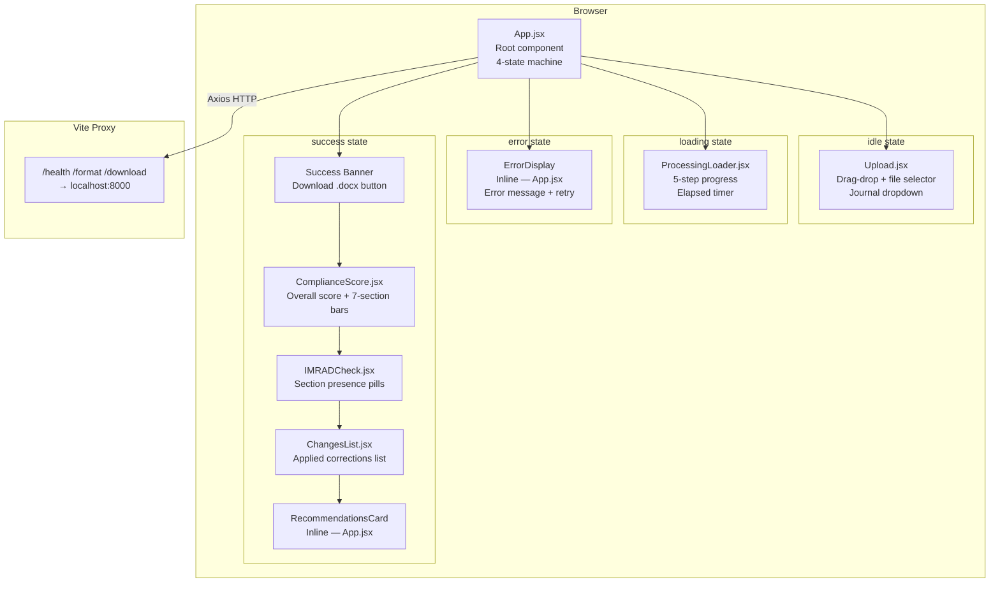
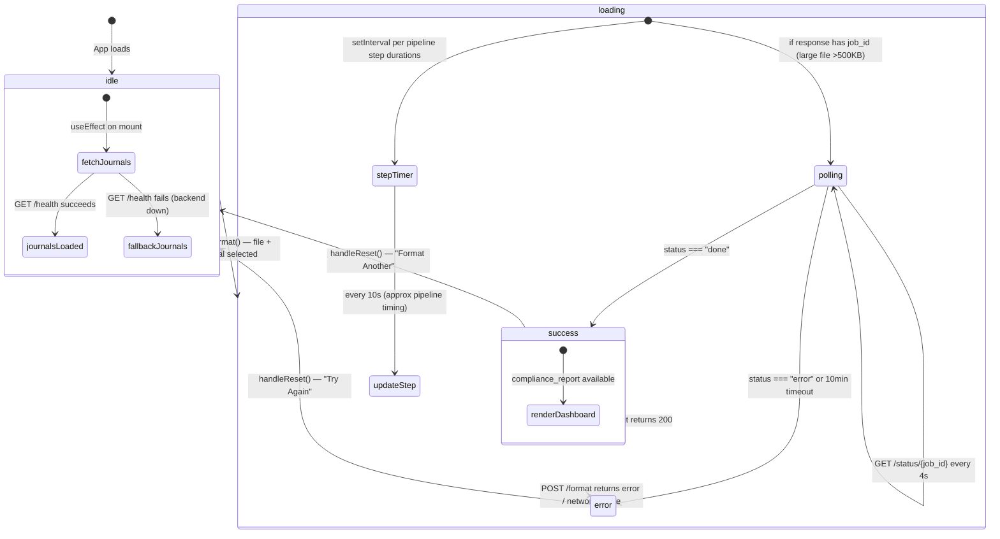

# Agent Paperpal — Frontend

> React 18 + Vite + TailwindCSS — dark-theme SPA for the autonomous manuscript formatting pipeline.

The frontend is a single-page application that guides the user through uploading a research paper, monitoring the 4-agent AI pipeline, and reviewing the compliance report with download access to the formatted DOCX output. Large papers (>500KB) are handled via async polling — the UI remains in loading state while the backend processes the job.

---

## Table of Contents

- [Architecture Overview](#architecture-overview)
- [State Machine](#state-machine)
- [Component Tree](#component-tree)
- [Directory Structure](#directory-structure)
- [Technology Stack](#technology-stack)
- [Component Reference](#component-reference)
- [Vite Proxy Configuration](#vite-proxy-configuration)
- [Installation](#installation)
- [Running the App](#running-the-app)
- [Build for Production](#build-for-production)
- [Environment Variables](#environment-variables)
- [Design System](#design-system)
- [Error Handling Strategy](#error-handling-strategy)
- [Performance](#performance)
- [Testing](#testing)

---

## Architecture Overview



---

## State Machine

`App.jsx` manages a single `appState` string — one of four values. All other state derives from it.



### State Transitions

| From | Event | To |
|------|-------|-----|
| `idle` | User clicks "Format Paper" with file + journal | `loading` |
| `loading` | `/format` 200 response | `success` |
| `loading` | Any error (network, 4xx, 5xx) | `error` |
| `error` | "Try Again" clicked | `idle` |
| `success` | "Format Another" clicked | `idle` |

---

## Component Tree

```
App.jsx
├── <header>                     # Sticky header with brand + processing time badge
│
├── {idle}
│   └── Upload.jsx               # File drop zone + journal selector + submit button
│
├── {loading}
│   └── ProcessingLoader.jsx     # 5-step pipeline progress + elapsed timer
│
├── {error}
│   └── ErrorDisplay             # Inline component: error message + "Try Again"
│
└── {success}
    ├── SuccessView              # Inline component — wraps all success content
    │   ├── <download banner>    # Green banner with Download .docx + Format Another
    │   ├── ComplianceScore.jsx  # Overall score + 7-section breakdown bars
    │   ├── ViolationsDetected.jsx # Phase A violations from transform agent
    │   ├── IMRADCheck.jsx       # Introduction/Methods/Results/Discussion pills
    │   ├── ChangesList.jsx      # Applied changes with expand/collapse
    │   └── RecommendationsCard # Inline component: recommendation list
    │
└── <footer>
```

---

## Directory Structure

```
frontend/
│
├── src/
│   ├── components/
│   │   ├── Upload.jsx            # File upload + journal selector form
│   │   ├── ProcessingLoader.jsx  # Pipeline progress visualization
│   │   ├── ComplianceScore.jsx   # Compliance score dashboard
│   │   ├── ChangesList.jsx       # Applied changes list with pagination
│   │   ├── ViolationsDetected.jsx # Phase A violations surfaced from transform agent
│   │   └── IMRADCheck.jsx        # IMRAD structure status display
│   │
│   ├── App.jsx                   # Root component: state machine + layout
│   ├── index.css                 # Tailwind imports + keyframes + utilities
│   └── main.jsx                  # ReactDOM.createRoot entry point
│
├── public/                       # Static assets served as-is
├── package.json                  # NPM dependencies and scripts
├── vite.config.js                # Vite config with dev proxy
├── tailwind.config.js            # Tailwind theme (dark-first)
├── postcss.config.js             # PostCSS with autoprefixer
└── index.html                    # HTML entry point
```

---

## Technology Stack

| Technology | Version | Purpose |
|-----------|---------|---------|
| React | 18.3.1 | UI component library |
| Vite | 7.3.1 | Dev server, HMR, production bundler |
| TailwindCSS | 3.4.3 | Utility-first CSS (dark theme) |
| PostCSS + Autoprefixer | 8.4.38 / 10.4.19 | CSS processing |
| Axios | 1.7.2 | HTTP client (used over fetch for consistent error handling) |
| Lucide React | 0.378.0 | Icon library (only source of icons — no emojis in JSX) |

---

## Component Reference

### App.jsx

Root component. Manages the 4-state machine and all HTTP communication.

**State:**

| State variable | Type | Description |
|---------------|------|-------------|
| `appState` | `"idle" \| "loading" \| "success" \| "error"` | Current application state |
| `file` | `File \| null` | Selected file object |
| `journal` | `string` | Selected journal name |
| `journals` | `string[]` | Journal list from `/health` or fallback |
| `result` | `object \| null` | Full `/format` response |
| `error` | `{message, code, step} \| null` | Parsed error object |
| `loadingStep` | `0-4` | Current pipeline step for `ProcessingLoader` |

**Key behaviors:**

- Fetches `/health` on mount (5s timeout) to populate journal dropdown; falls back to `FALLBACK_JOURNALS` on failure — no error shown to user.
- `FORMAT_TIMEOUT_MS = 0` — pipeline runs indefinitely, no client-side timeout.
- Step timer advances `loadingStep` on approximate pipeline timings (10s/10s/2s/15s/10s) to animate the loader.
- If `/format` returns `{job_id, poll_url}`, `pollJobStatus()` polls every 4s (max 150 polls / 10 min).
- `document.documentElement.classList.add("dark")` — enforces permanently dark theme.

**Error parsing logic:**

```
err.code === "ERR_NETWORK"          → "Cannot connect to backend" (code: network_error)
err.response.status === 502 | 503   → same (Vite proxy ECONNREFUSED)
err.response.data.detail (object)   → detail.error + detail.step
err.response.data.detail (string)   → raw string message
otherwise                           → "An unexpected error occurred"
```

---

### Upload.jsx

File upload form with drag-and-drop zone, file size display, and journal selector.

**Props:**

| Prop | Type | Description |
|------|------|-------------|
| `file` | `File \| null` | Currently selected file |
| `setFile` | `Function` | File state setter |
| `journal` | `string` | Currently selected journal |
| `setJournal` | `Function` | Journal state setter |
| `journals` | `string[]` | Available journals (from `/health`) |
| `onSubmit` | `Function` | Called when "Format Paper" is clicked |

**Key behaviors:**

- Accepts PDF and DOCX only (HTML `accept` attribute + manual extension check)
- Hard rejects files > 10 MB with inline error (no `alert()`)
- Shows soft warning for files 5-10 MB (not a rejection)
- `formatFileSize(bytes)` — displays B / KB / MB appropriately
- `truncateFilename(name, maxLen=40)` — truncates long filenames preserving extension
- "Loading journals..." placeholder shown while `journals` is empty
- Submit button disabled unless both file and journal are selected

---

### ProcessingLoader.jsx

Displays the 5-step pipeline progress with per-step status indicators and a live elapsed timer.

**Props:**

| Prop | Type | Description |
|------|------|-------------|
| `currentStep` | `0-4` | Active pipeline step index |
| `journal` | `string` | Target journal name (displayed) |
| `filename` | `string` | Original filename (displayed) |

**Pipeline steps:**

| Step | ID | Label | Sublabel | Icon |
|------|----|-------|---------|------|
| 1 | 0 | Reading document | Extracting text from your PDF/DOCX | `FileText` |
| 2 | 1 | Detecting structure | Identifying title, abstract, sections, citations | `Search` |
| 3 | 2 | Loading journal rules | Fetching formatting requirements | `BookOpen` |
| 4 | 3 | Applying formatting | Fixing fonts, headings, citations, references | `Wrench` |
| 5 | 4 | Validating compliance | Running 7 quality checks, generating score | `CheckSquare` |

**Step statuses:**
- `done` — step index < `currentStep` — green `CheckCircle` icon
- `active` — step index === `currentStep` — spinning blue ring + blue highlight background
- `pending` — step index > `currentStep` — gray empty circle

**Timer**: `useEffect` + `setInterval(1s)` starts on mount, cleared on unmount. Displays `M:SS` format. After 60 seconds, footer message changes to "Taking longer than usual..."

---

### ComplianceScore.jsx

Full compliance score dashboard with animated progress bars and collapsible issue lists.

**Props:**

| Prop | Type | Description |
|------|------|-------------|
| `report` | `object \| null` | Compliance report from API; `null` triggers skeleton mode |

**Key behaviors:**

- Shows skeleton pulse rows when `report` is `null` (loading state)
- Overall score bar animates from 0% → score% via `useEffect + setTimeout(100ms)`
- Per-section bars animate from 0% → score% via `useEffect + setTimeout(80ms)`
- Each section shows max 3 issues, with "Show X more" / "Show less" toggle
- `submission_ready` banner: green if true, yellow if false
- Fixed 7-section order always rendered — missing API sections show "N/A"
- Color thresholds: green >= 90, yellow >= 70, red < 70
- Citation consistency section conditionally rendered (only if orphan/uncited entries exist)
- Warnings section conditionally rendered

**Score color mapping:**

| Score | Text color | Bar color |
|-------|-----------|-----------|
| >= 90 | `text-green-400` | `bg-green-500` |
| >= 70 | `text-yellow-400` | `bg-yellow-500` |
| < 70 | `text-red-400` | `bg-red-500` |

---

### ChangesList.jsx

Collapsible list of formatting corrections applied by the pipeline.

**Props:**

| Prop | Type | Description |
|------|------|-------------|
| `changes` | `string[]` | Applied change descriptions |

**Key behaviors:**

- Returns `null` if `changes` is empty, null, or undefined
- Shows first 6 items by default
- "Show X more changes" / "Show less" toggle for lists > 6 items
- Change text rendered in `font-mono` for legibility
- Numbered list with blue circle badges

---

### ViolationsDetected.jsx

Displays the Phase A violation scan results from the Transform agent — one card per detected rule violation.

**Props:**

| Prop | Type | Description |
|------|------|-------------|
| `data` | `object` | `{violations: [...], total_violations, journal}` from `interpretation_results` |

**Key behaviors:**

- Rendered only when `interpretationResults?.violations?.length > 0`
- Each violation shows: `rule_category`, `rule_description`, `rule_reference`, `violation_found`, `fix_applied`
- Color-coded by severity — violations use red/amber badges

---

### IMRADCheck.jsx

Displays IMRAD (Introduction / Methods / Results / Discussion) section presence as colored pills.

**Props:**

| Prop | Type | Description |
|------|------|-------------|
| `imrad` | `object \| null` | `{introduction, methods, results, discussion}` booleans |

**Key behaviors:**

- Returns `null` if `imrad` prop is null/undefined
- Green pill with `CheckCircle` for present sections
- Red pill with `XCircle` for missing sections
- Complete banner (green) if all 4 sections present
- Incomplete banner (yellow) listing missing sections if any absent
- Uses boolean field values as source of truth — not `imrad_complete` field

---

## Vite Proxy Configuration

[vite.config.js](vite.config.js) proxies all API routes to the backend:

```js
proxy: {
  "/format":   { target: "http://localhost:8000", timeout: 0 },
  "/download": { target: "http://localhost:8000", timeout: 0 },
  "/health":   { target: "http://localhost:8000", timeout: 0 },
  "/status":   { target: "http://localhost:8000", timeout: 5000 },
}
```

- `timeout: 0` — no proxy timeout for `/format` and `/download`; `/status` uses 5s (polling calls are short)
- All API calls use relative URLs (`/format`, `/health`, `/download/*`, `/status/*`) — no hardcoded ports in React code
- In production, replace the proxy with a reverse proxy (nginx, Caddy) or update `VITE_BACKEND_URL`

**Note**: If the backend is not running, Vite returns HTTP 502. The frontend maps 502 to a "Cannot connect to backend" message. The `/health` call on mount will silently fall back to `FALLBACK_JOURNALS` — no error is shown.

---

## Installation

### Prerequisites

- Node.js 18+
- npm 9+

### Steps

```bash
cd frontend
npm install
```

---

## Running the App

### Development (with HMR)

```bash
npm run dev
```

App runs at **http://localhost:5173** by default.

The backend must be running at `http://localhost:8000` for API calls to work. See [backend/README.md](../backend/README.md) for backend setup.

### Custom Port or Backend URL

Create a `.env` file in the `frontend/` directory:

```env
VITE_PORT=3000
VITE_BACKEND_URL=http://my-backend-host:8000
```

---

## Build for Production

```bash
npm run build
```

Output goes to `frontend/dist/`. This is a static site — deploy to any static host (Vercel, Netlify, nginx, S3 + CloudFront).

```bash
npm run preview    # Preview the production build locally
```

In production, the Vite proxy is not available. You must configure a reverse proxy (e.g., nginx) to forward `/format`, `/download`, and `/health` to the backend.

**nginx example:**
```nginx
location /format   { proxy_pass http://backend:8000; }
location /download { proxy_pass http://backend:8000; }
location /health   { proxy_pass http://backend:8000; }
location /         { root /var/www/frontend/dist; try_files $uri /index.html; }
```

---

## Environment Variables

| Variable | Default | Description |
|----------|---------|-------------|
| `VITE_PORT` | `5173` | Dev server port |
| `VITE_BACKEND_URL` | `http://localhost:8000` | Backend URL used by Vite proxy |

Variables must be prefixed with `VITE_` to be available in the browser bundle.

---

## Design System

### Theme

Permanently dark theme — no light/dark toggle. Applied via:
```js
document.documentElement.classList.add("dark")
```

### Color Tokens

| Token | Hex | Usage |
|-------|-----|-------|
| `bg-gray-950` | `#030712` | Page background |
| `bg-gray-900` | `#111827` | Card backgrounds |
| `bg-gray-800` | `#1f2937` | Input backgrounds, borders |
| `text-white` | `#ffffff` | Primary text |
| `text-gray-400` | `#9ca3af` | Secondary text |
| `text-gray-500` | `#6b7280` | Muted text |
| `text-blue-400` | `#60a5fa` | Active/highlight |
| `text-green-400` | `#4ade80` | Success |
| `text-yellow-500` | `#eab308` | Warning |
| `text-red-400` | `#f87171` | Error |

### Icons

**Lucide React only** — no emojis in JSX. All icons sized consistently:
- Primary icons: `w-4 h-4`
- Small inline icons: `w-3.5 h-3.5`
- Large decorative: `w-8 h-8` or `w-12 h-12`

### Typography

| Class | Usage |
|-------|-------|
| `text-3xl font-bold` | Page heading |
| `text-base font-semibold` | Card heading |
| `text-sm font-medium` | Section label |
| `text-xs` | Badges, captions, sublabels |
| `font-mono` | File names, change descriptions, code |

### Animations

Defined in [src/index.css](src/index.css):

| Class | Keyframe | Usage |
|-------|----------|-------|
| `animate-fade-in` | `fadeIn` — translateY(8px) → 0, opacity 0 → 1 | State transitions |
| `animate-shimmer` | `shimmer` — moving gradient | Skeleton loaders |
| `animate-spin` | `spin` — rotate 360deg | Loading spinners |
| `animate-pulse` | `pulse` — opacity 1 → 0.4 | Skeleton rows in `ComplianceScore` |

### Border Radius

All cards use `rounded-2xl`. Buttons use `rounded-xl`. Pills use `rounded-full`.

---

## Error Handling Strategy

The frontend handles three categories of failure:

### 1. Backend Unreachable (Network Error / 502)

Triggered when Vite proxy gets ECONNREFUSED from the backend.

**Detection**: `err.code === "ERR_NETWORK"` OR `err.response?.status === 502 || 503`

**User message**: "Cannot connect to the backend server. Make sure it is running on port 8000."

### 2. Validation Errors (4xx)

The backend returns structured `{ success: false, error: "...", step: "..." }` in the response body.

**User message**: The `error` field from the API response, with `step` shown as a subtitle.

### 3. Server Errors (5xx)

The backend global handler returns a sanitized generic message.

**User message**: The `error` field (e.g., "An unexpected pipeline error occurred. Please try again.").

### /health Failure

Handled silently — falls back to `FALLBACK_JOURNALS` list. No error state is entered.

---

## Performance

| Optimization | Implementation |
|-------------|---------------|
| `FORMAT_TIMEOUT_MS = 0` | No client-side timeout — pipeline runs to completion |
| Vite `timeout: 0` | No proxy-side timeout for `/format` and `/download` |
| Animated skeleton UI | `ComplianceScore` shows skeleton rows during loading rather than empty state |
| `AnimatedBar` component | Score bars animate 0 → score with `setTimeout(80ms)` delay |
| Journal fallback | `/health` failure never blocks rendering — fallback list used immediately |
| Step timer | `setInterval` cleared on unmount to prevent memory leaks |
| `INITIAL_VISIBLE = 6` | `ChangesList` renders first 6 items, rest on demand |
| `MAX_VISIBLE_ISSUES = 3` | `ComplianceScore` collapses issues per section after 3 |

---

## Testing

### Manual Test Checklist

| Scenario | Expected Behavior |
|----------|------------------|
| App loads with backend down | Journal dropdown shows fallback list, no error |
| App loads with backend up | Journal dropdown shows journals from `/health` |
| Upload `.txt` file | Inline error: "Only PDF and DOCX files are supported" |
| Upload file > 10 MB | Inline error: "File exceeds 10 MB limit" |
| Upload file 5-10 MB | Yellow soft warning, submit still enabled |
| Submit without journal | Submit button disabled |
| Submit valid PDF + journal | Loading state with 5-step pipeline progress |
| Pipeline completes | Success state: score dashboard + download button |
| Click Download | Browser opens new tab and downloads `.docx` |
| Click Format Another | Returns to idle state, all fields reset |
| Long paper (>60s) | Footer message changes to "Taking longer than usual..." |
| Large file (>500KB) | HTTP 202 received; UI stays in loading state while polling `/status/{job_id}` |
| Async job completes | Polling detects `status === "done"`, transitions to success state |
| Backend returns error during pipeline | Error state with specific message + "Try Again" |
| Kill backend mid-request | Error state: "Cannot connect to backend..." |

### Unit Tests (Vitest)

```bash
npm install --save-dev vitest @testing-library/react @testing-library/jest-dom
npx vitest run
```

Key components to unit test:
- `formatFileSize()` — boundary values (0 B, 1023 B, 1024 B, 1 MB)
- `truncateFilename()` — short names, exact 40 chars, long names with/without extension
- `IMRADCheck` — null prop, all present, some missing
- `ChangesList` — null, empty, 6 items, 7+ items (show more toggle)
- `ComplianceScore` — null report (skeleton), all 7 sections, missing sections

---

*Frontend — Agent Paperpal · HackaMined 2026*
